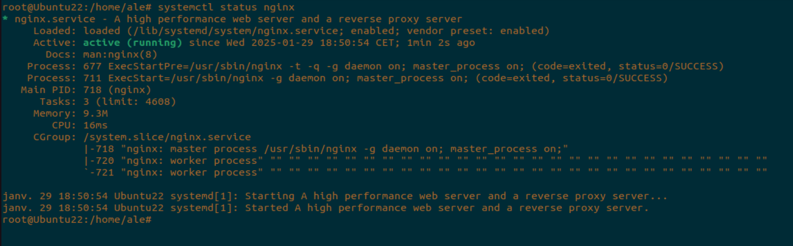

<h1 align="center"> CASOS PRÁCTICOS </h1>  
 
 

## ENUNCIADO  
Acabamos de terminar el CFGS ASIR y encuentramos trabajo en la empresa Servicios Web RC, SA en Huelva. Anteriormente utilzaban Apache como servidor web y quiere migrar a Nginx. Una vez instalado y configurado procedemos a realizar todos los casos prácticos solicitados.  
 
 

### A) VERSIÓN DE NGINX INSTALADO  
Para ver la versión de Nginx hay que ejecutar en un terminal *__nginx -v__*  
 

  

 
 

### B) SERVICIO ASOCIADO  
Para ver que Nginx está configurado correctamente y en ejecución se utiliza *__systemctl status nginx__*  
 

  
 
> [!NOTE]
> Otros comandos para gestionar el servicio son:
> - systemctl start nginx
> - systemctl stop nginx
> - systemctl reload nginx
> - systemctl restart nginx
 
 

### C) INSPECCIONAR LOS FICHEROS DE CONFIGURACIÓN  
El directorio de Nginx está situado en *__/etc/nginx__*  
 

  
 
Su archivo de configuración es el *__nginx.conf__*  
 

  
 

### D) MODIFICACIÓN DE LA PÁGINA WEB  
Para modificar la página predeterminada de Nginx hay que modificar el archivo *__/var/www/html/index.nginx-debian.html__*
 

  
 
