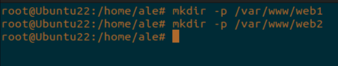
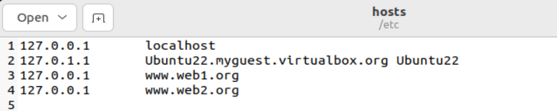
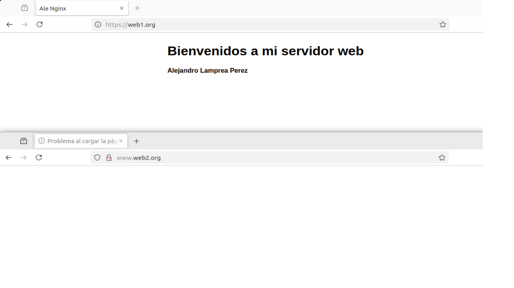

<h1 align="center"> CASOS PRÁCTICOS </h1>  
 
 

## ENUNCIADO  
Acabamos de terminar el CFGS ASIR y encuentramos trabajo en la empresa Servicios Web RC, SA en Huelva. Anteriormente utilzaban Apache como servidor web y quiere migrar a Nginx. Una vez instalado y configurado procedemos a realizar todos los casos prácticos solicitados.  
 
 

### A) VERSIÓN DE NGINX INSTALADO  
Para ver la versión de Nginx hay que ejecutar en un terminal *__nginx -v__*  
 

  

 
 

### B) SERVICIO ASOCIADO  
Para ver que Nginx está configurado correctamente y en ejecución se utiliza *__systemctl status nginx__*  
 

  
 
> [!NOTE]
> Otros comandos para gestionar el servicio son:
> - systemctl start nginx
> - systemctl stop nginx
> - systemctl reload nginx
> - systemctl restart nginx
 
 

### C) INSPECCIONAR LOS FICHEROS DE CONFIGURACIÓN  
El directorio de Nginx está situado en *__/etc/nginx__*  
 

  
 
Su archivo de configuración es el *__nginx.conf__*  
 

  
 

### D) MODIFICACIÓN DE LA PÁGINA WEB  
Para modificar la página predeterminada de Nginx hay que modificar el archivo *__/var/www/html/index.nginx-debian.html__*
 

  
 

### E) VIRTUAL HOSTING  
El servidor poseerá dos sitios webs. Para ello hay que seguir los siguientes pasos:
 

*__Creación de los directorios__*
 

 

*__Concesión de permisos para los directorios__*  
  
 

*__Creación de los index.html para sitio web__*
 

  
 

*__Creación de los sites-available para cada sitio__*
 

  
 

*__Configuración del archivo hosts para las webs__*
 

  
 

*__Resultado final__*  
 

  
 

### F) AUTENTICACIÓN, AUTORIZACIÓN Y CONTROL DE ACCESO  
La web1 puede acceder desde la red externa y la red interna, pero la web2 solo desde la interal. Para conseguir esto necesitamos hacer:  
 
*__Modificar los sites-available de cada uno__*  
 

  
 

*__Modificar el archivo hosts con las ips que permitimos tanto para red externa como interna__*  
 

  
 

*__Comprobacion de la red interna usando curl__*  
 

  
 

*__Comprobación de la red externa__*  
 

  
 

### G) AUTENTICACIÓN, AUTORIZACIÓN Y CONTROL DE ACCESO  
 
Web1.org contiene un directorio privado al que sólo pueden acceder usuarios válidos.  
 

*__Volver a modificar el sites available__*  
 

  
 

*__Comprobación de que web1.org/privado requiere acceso__*  
 

  
 

*__Comprobación de que tengo acceso__*  
 

  
   

### H) AUTENTICACIÓN, AUTORIZACIÓN Y CONTROL DE ACCESO  

La web1 contiene un directorio llamado privado. Desde la red externa pide autorización y desde la red interna NO.  

*__Volver a modificar el sites-available__*  
 

  
 

### I) SEGURIDAD  
 
Configurar el sitio de web1 para que el acceso sea seguro. Para ello hay que crear una key privada:  

 

> openssl req -x509 -nodes -days 365 -newkey rsa:2048 -keyout /etc/ssl/private/selfigned.key -out /etc/ssl/certs/selfsigned.crt
 

  
 

*__Por último volver a modificar el archivo sites-available__*  
 

  
 

