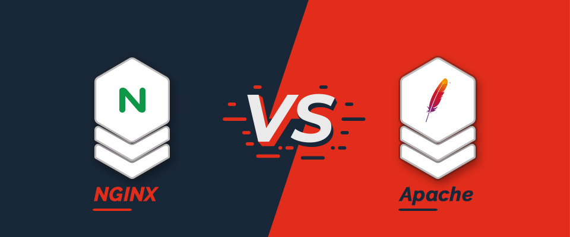

<h1 align="center"> COMPARATIVA CON APACHE </h1>
 
 

  

### NGINX VS APACHE: COMPARATIVA EN EL MUNDO DE LOS SERVIDORES WEB  
Durante mucho tiempo, Apache ha sido el líder indiscutible en el ámbito de los servidores web. Sin embargo, en los últimos años, la popularidad de Nginx ha crecido de manera notable, convirtiéndose en la opción preferida de grandes empresas tecnológicas como Facebook y WordPress.

En la actualidad, no cabe duda de que para sitios con una demanda elevada, como plataformas de comercio electrónico, servicios de streaming y redes sociales, Nginx destaca por su capacidad para gestionar múltiples conexiones simultáneas de manera eficiente.

Eso no significa que Apache haya quedado en desuso. Sigue siendo una alternativa confiable en muchos entornos, pero la aparición de Nginx ha introducido un nuevo enfoque para mejorar el rendimiento y la escalabilidad en servidores web modernos.

A continuación, veremos las diferencias más importantes entre ambos servidores y qué los hace sobresalir en el ecosistema actual.  
 

### PRINCIPALES DIFERENCIAS ENTRE NGINX Y APACHE  
*__Modelo de Gestión de Solicitudes__*  
 
> Apache funciona con un modelo basado en procesos o hilos, en el que cada conexión se asigna a un proceso o hilo independiente. Aunque este sistema es efectivo en muchos casos, puede volverse ineficiente cuando se manejan miles de conexiones simultáneas, ya que consume una gran cantidad de recursos.

> Por otro lado, Nginx adopta un modelo asincrónico y basado en eventos, lo que le permite gestionar múltiples conexiones dentro de un solo hilo. Esto se traduce en un menor uso de memoria y un mejor rendimiento en sitios con alta concurrencia.
 

*__Desempeño en la Entrega de Contenido Estático__*  
 
> Si el objetivo es servir contenido estático como imágenes, archivos CSS o JavaScript, Nginx tiene una ventaja considerable gracias a su arquitectura optimizada. Su eficiencia lo convierte en una excelente opción para sitios web que dependen en gran medida de este tipo de recursos.
 

*__Flexibilidad en la Configuración__*  
 
> Apache se destaca por su flexibilidad, especialmente por el uso de archivos .htaccess, que permiten realizar configuraciones a nivel de directorio sin necesidad de modificar el archivo principal del servidor. Esto resulta útil en entornos compartidos, donde varios desarrolladores pueden personalizar sus configuraciones de manera independiente.
> En cambio, Nginx no utiliza .htaccess y requiere que todas las configuraciones se definan en su archivo principal. Aunque esto podría parecer una limitación, en realidad contribuye a un mejor rendimiento y reduce el riesgo de errores debido a configuraciones dispersas.
 

*__Compatibilidad con Tecnologías Modernas__* 
 
> Nginx fue diseñado pensando en la eficiencia y el alto rendimiento, por lo que ofrece soporte nativo para tecnologías avanzadas como:

> - HTTP/2 y HTTP/3: Protocolos que optimizan la velocidad y la transmisión de datos.
> - WebSocket: Ideal para aplicaciones en tiempo real, como chats y notificaciones en vivo.
> - Balanceo de carga: Permite distribuir el tráfico entre múltiples servidores de manera eficiente.
>Si bien Apache también ha incorporado soporte para muchas de estas tecnologías, su implementación puede ser menos eficiente o requerir configuraciones más complejas en comparación con Nginx.
