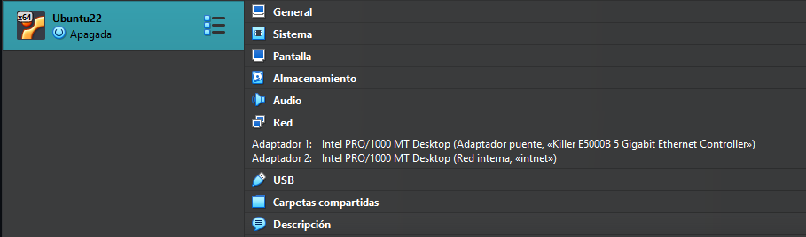

<h1 align="center"> ESQUEMA DE RED </h1>  
 
 

## DESCRIPCIÓN DEL ESQUEMA  
El servidor está configurado con dos tarjetas de red:  
- La primera (enp0s3) en adaptador puente.
- La segunda (enp00s8) en red interna.
 

