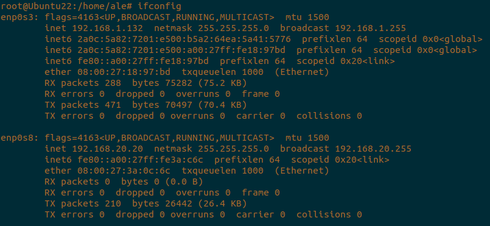

<h1 align="center"> ESQUEMA DE RED </h1>  
 
 

## DESCRIPCIÓN DEL ESQUEMA  
El servidor está configurado con dos tarjetas de red:  
- La primera (enp0s3) en adaptador puente.
- La segunda (enp00s8) en red interna.
  
  

 

## CONFIGURACIÓN DE LAS REDES  
Para la configuración de las redes hay que modificar el /etc/netplan/01-network-manager-all.yaml  
- La enp0s3 estará en DHCP.  
- La enp0s8 será IP estática.
  

  

 

Es necesario ejecutar un *__netplan apply__* después de guardar los cambios en el netplan y reiniciar el NetworkManager.  

 

  

